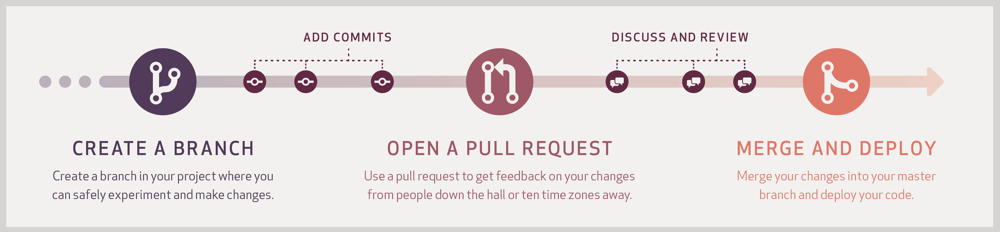

# ORGNAME Backend

## Overview

Some overview

## Setting Up Your Dev Environment

1. Install Docker
2. Install gcloud
3. Install go 1.22+
4. Create a .gitaccess file which will prove private access to repos [Personal access tokens](https://github.com/settings/tokens)
5. Set gcloud project `gcloud config configurations create example-project-dev && gcloud config set project example-project-dev && gcloud auth login`

## Deploying to Dev

1. Set gcloud configuration to dev (see above) `gcloud config configurations activate example-project-dev`
2. Build and deploy `./scripts/deploy-cont example`

-------

## Example Service
Description of service

## Contributing to this repo

### Development processes
Github Flow:

- [Semantic commit messages](https://gist.github.com/joshbuchea/6f47e86d2510bce28f8e7f42ae84c716)
- [Versioning](https://en.wikipedia.org/wiki/Software_versioning)

#### Example Development Flow

1. pull main then branch off of main `git pull --rebase main && git checkout -b describe-my-feature` (note the hyphen separated branch name)
2. develop and add files to git `git add .`
3. commit using semantic commit messages `git commit -m "feat: home page widget"`
> __Why semantic commits__: 
> The purpose of semantic commit messages is to prevent developers from lumping a bunch of uncorrelated changes in the same commit. Remember
> someone must read your commits later and the message should explain what is happening in the code.   
> __Some example commits__: 
> "chore: added new colors to app themes" 
> "docs: updated README.md to explain commit messages" 
> "feat: created device onboarding flow" 
> "refactor: refactored material routes" 
> "fix: fixed bug which resulted in duplicate text on home page" 
4. push to feature branch `git push -u origin describe-my-feature`
5. request a pull request
6. if pull request is successful, the feature branch will be merged into main
> __Why Github flow__: 
> Github flow is a variation of trunk-based development popular in modern development teams for its compatibility with CI/CD practices.  
> Trunk-based git processes help avoid long divergent, and therefore hard to merge, branches forming.  
> Pull Requests help with team learning and communication, and allow each member of the team to have visibility on code changes.

#### Best Practices

##### Don't!
- Combine multiple tickets into a single PR
- Create a feature and refactor in the same PR - this makes review very difficult
- Merge your own PR

##### Do
- Merge main before creating PR
- Add GIFs demonstrating UI PRs
- Create screenshots of a UI feature on different screen sizes
- Test locally before creating PR (iOS and Android if possible)
- Go through difficult code reviews together using video conferencing software (e.g. Zoom)

> __About Pull Requests__: 
> Due to the agility of this project, Pull Requests are not intended to be gatekeepers to a live production system but rather to
> assist inter-team communication on code changes and to ensure quality in the absence of a dedicated QA team.
> Project leads might commit directly to main without awaiting code review if they deem it necessary. All other developers should avoid committing to main at all times. 